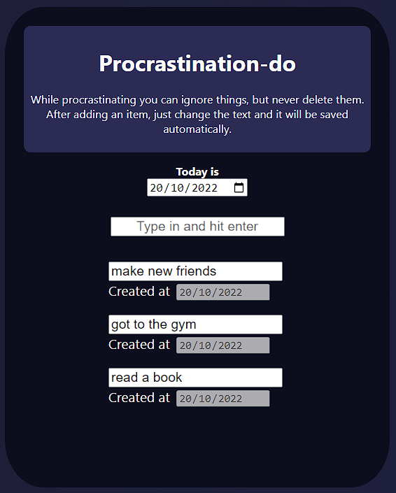
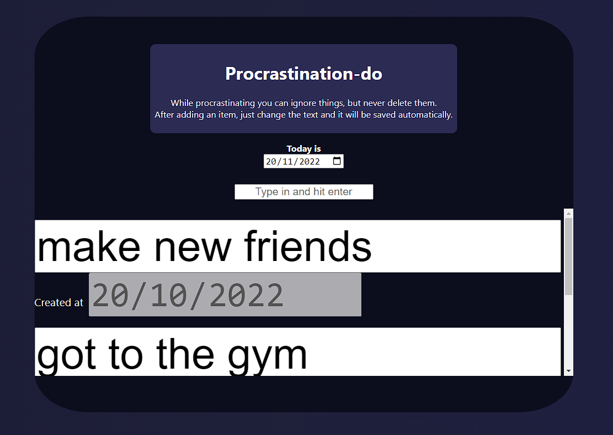
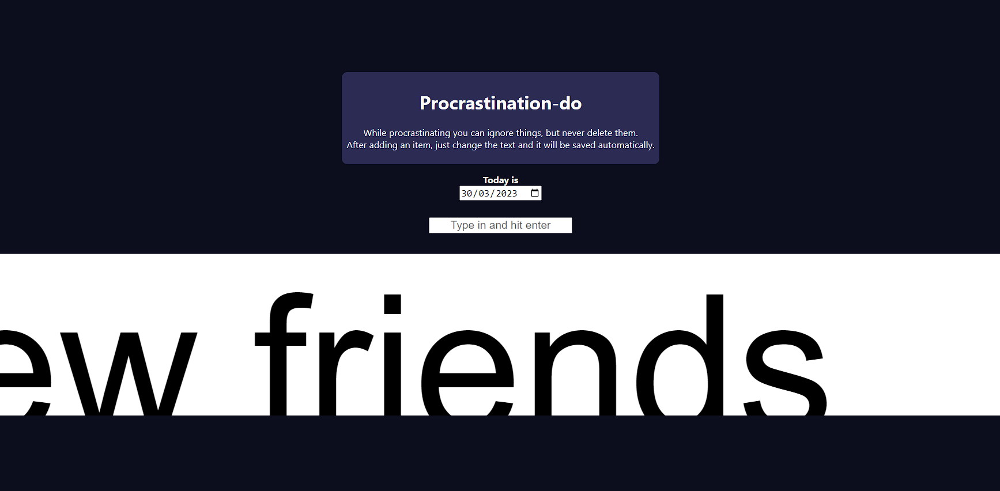

# Procrastination-do

A joke js todo app where you add items to procrastinate and as the days goes by their size increases until the app is unusable.

# Running

Just open index.html in your browser.

# Application

When you are starting out

Some time has passed

The app is unusable (like your life)

[Checkout the JavaFx counterpart here](https://github.com/Artenes/ProcrastinationDoJavaFx).